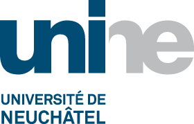
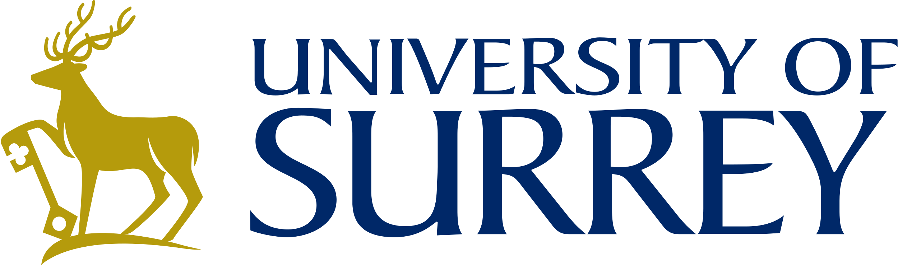
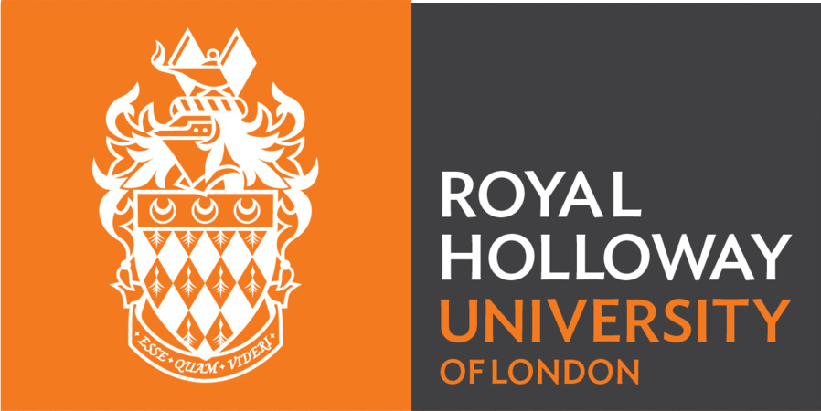

# Principal investigators

* [Pierre Sutra](https://sites.google.com/site/0track), Télécom SudParis (France), _coordinator_
* [Petr Kuznetsov](https://perso.telecom-paristech.fr/kuznetso/), Télécom Paris (France)
* [Alexey Gotsman](https://software.imdea.org/~gotsman/), IMDEA Software (Spain)
* [Valerio Schiavoni](http://members.unine.ch/valerio.schiavoni/), University of Neuchâtel (Switzerland)
* [Gregory Chockler](https://gchockler.com/), University of Surrey (United Kingdom)
* [Brijesh Dongol](https://brijeshdongol.github.io/), University of Surrey (United Kingdom)
* [Daniel O’Keefe](https://pure.royalholloway.ac.uk/en/persons/daniel-okeeffe), Royal Holloway College, University of London (United Kingdom)

# Consortium

  

 

 

 

